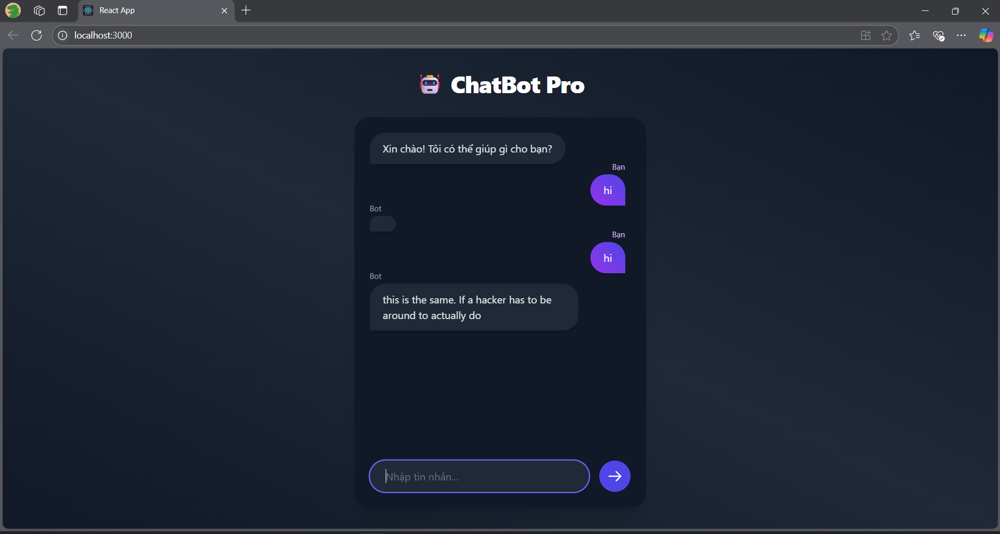

# Chatbot Project

The project consists of a **Frontend** built with React and a **Backend** built with Flask. The goal is to develop a chatbot with a user-friendly interface and a backend that handles the logic and AI model.

---

## Description

- **Frontend:** React app provides the chat interface.
- **Backend:** Flask API provides endpoints to process chat requests and call the AI model.
- **Connection:** The frontend sends requests to the backend to receive chatbot responses.

---

## Requirements

- Python 3.8+

---

## Installation & Usage Guide

### 1. Backend (Flask)

#### Create a virtual environment and install dependencies

```bash
# Create a virtual environment (use python3 or python if you have multiple versions)
python -m venv venv

# Activate the virtual environment
# Windows:
venv\Scripts\activate
# macOS/Linux:
source venv/bin/activate

# Install dependencies from requirements.txt
pip install -r requirements.txt
```

#### Download AI model (`model.safetensors`)

Due to GitHub's file size limit (<100MB), you need to download the model from Google Drive and place it in the correct location:

**👉 Download model link:**  
[📥 Download from Google Drive](https://drive.google.com/drive/u/0/folders/1Uz06kBuGJ3ZEl1lQPuTPv-D3erl4flu2)

**Place the file at:**
```
backend/trained_model/model.safetensors
```

#### (Optional) Download automatically using a Python script

```bash
pip install gdown
```

```python
# download_model.py
import gdown
import os

url = "https://drive.google.com/uc?id=1AbcDEfGhijKlmNOpqrStUVwxYZ"
output = "backend/trained_model/model.safetensors"

if not os.path.exists(output):
    print("Downloading model...")
    gdown.download(url, output, quiet=False)
else:
    print("Model already exists.")
```

Then run:

```bash
python download_model.py
```

#### Run Flask backend

```bash
cd backend
# Activate the virtual environment
# Windows:
venv\Scripts\activate
# macOS/Linux:
source venv/bin/activate
python app.py
```

The backend will run by default at `http://127.0.0.1:5000`

---

### 2. Frontend (React)

#### Install dependencies

```bash
cd frontend

# Install dependencies
npm install
# or
yarn install
```

#### Run React frontend

```bash
npm start
# or
yarn start
```

The frontend will run by default at `http://localhost:3000`

---

## Frontend - Backend Connection Configuration

- In the frontend source code, make sure the backend API URL is correct. For example:

```js
const API_URL = 'http://127.0.0.1:5000';
```

- When making requests (using fetch or axios) from the frontend, use `API_URL` as the base URL.

---

## Suggested Folder Structure

```
root/
├── backend/
│   ├── app.py
│   ├── requirements.txt
│   └── trained_model/
│       └── model.safetensors
├── frontend/
│   ├── package.json
│   ├── src/
│   └── ...
└── README.md
```

---

## Notes

- When deploying, make sure to configure CORS so the frontend can call the backend (e.g., use `flask-cors` in Flask).
- Always activate the virtual environment when working with the backend to ensure the correct library versions.
- You may need to configure a proxy in React to call the backend API when deploying.

---

## Demo Image

